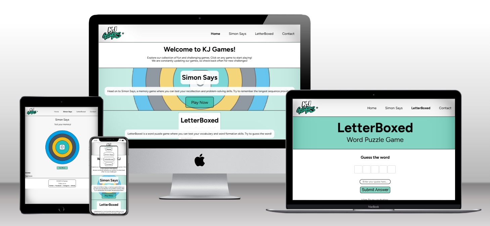
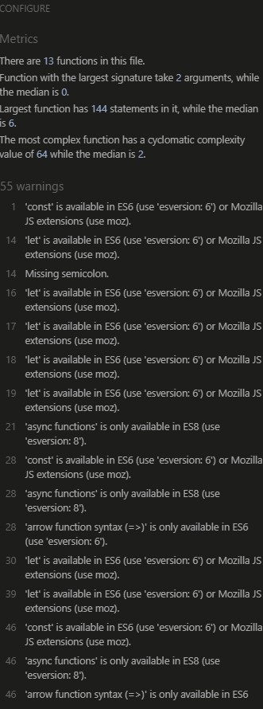
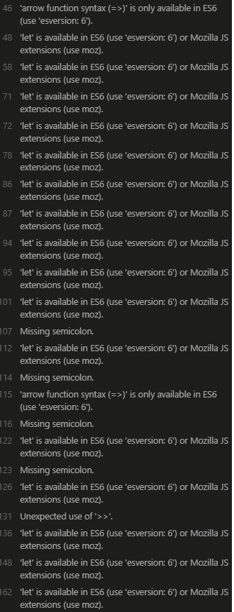
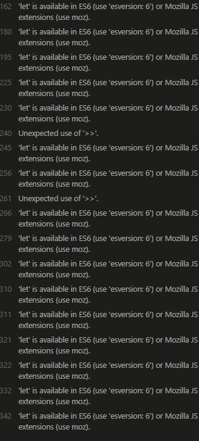

# Overview
KJ Games is aiming to be a simple games website
Consisting of a game per page and being easily expandable

Target Audience:
- People with some free time looking to occupy themselves
- Children with limited access to the internet being allowed to play simple games
- People bored at work / school looking for something to do

# User Experience [UX]

### Design

### First Time Visitor Goals

- As a first time visitor I want to be able to easily understand the functionality of the website
- As a first time visitor I want to be able to immediately understand how to navigate and use the features of the website.
- As a first time visitor I expect the website to display appropriately on all the types of screen I view it on
- As a first time visitor I want to easily be able understand how to use the main features of the website

### Returning Visitor Goals

- As a returning visitor, I want to be able to play the same games again consistently without any bugs
- As a returning visitor, I want to be able to suggest new ideas for games to be implemented.

### Colour Scheme

In order to keep each game consistent and simplistic but also professional and eyecatching. I opted for a neutral green and white contrast for the background and navbar.

The primary colours are `1BB295`, `#FFFFFF` and `#000000`

### Usage
- **Straightforward Navigation**  
  Responsive navbar allows for straightforward navigation on all devices
- **Gameplay**  
  Users can choose between their game of choice and be presented with easily accessible games

## Development Process
1. **Initial Setup:**  
   Set up basic HTML, CSS, and JavaScript files.
2. **Set up of Basic Gameplay containers**  
   Using JS and CSS to dynamicaly manipulate the DOM to present clean gameplay features
3. **API Integration:**  
   Integrated two API's that feed data from one to the other - specifities can be found below
4. **Main Game Logic**  
   Used developer tools and console testing to develop a wordle clone

## Technologies Used

### Languages, API's & Source Control
- **HTML5, CSS3, and JavaScript** for the client-side interface.
- **Word generator API** to fetch words. [API Link](https://random-word-api.herokuapp.com/home)
- **Dictionary API** to provide hints for words. [API Link](https://dictionaryapi.dev)
- **CSS Grid & Flexbox** for responsive layout.
- **Git & GitHub** for version control and repository hosting.

### Tools   
- **Visual Studio Code** as the development environment.  
- **Live Server Extension** for live preview.  
- **W3C Validators** for HTML/CSS validation.
- **JSHint** for JS validation.  
- **Chrome DevTools** for responsiveness & lighthouse testing.
- **Google Fonts** Used for typography across the site.

## Wireframes

### Desktop

- [Homepage](assets/images/homeDesktopWireframe.png)
- [Simon Says](assets/images/simonDesktopWireframe.png)
- [LetterBoxed](assets/images/letterboxedDesktopWireframe.png)
- [Contact](assets/images/contactDesktopWireframe.png)

### Mobile

- [Homepage](assets/images/homeMobileWireframe.png)
- [Simon Says](assets/images/simonMobileWireframe.png)
- [LetterBoxed](assets/images/letterboxedMobileWireframe.png)
- [Contact](assets/images/contactMobileWireframe.png)

## Bug Fixes

### Bug 001 - NavBar Hamburger was overlaying onto main content 
- Bug fix - Used a Z-index of greater than 1 to force NavBar above main content 

### Bug 002 - Styles not updating in init game function in line with guesses 
- Bug fix - Added conditional checks for classes applied during the onGuess() function - **[Github Commit Link for Code Changes](https://github.com/Ljkkj7/Milestone2/commit/6aa3b99b220a09d0915aaa29d733f001fc2daccc)**

### Bug 003 - Applied style not updating correctly in line with letters
- Bug fix - Addition of an apply list array to check amount of times the style was applied during a guess and introducing conditional checks with this function - **[Github Commit Link for Code Changes](https://github.com/Ljkkj7/Milestone2/commit/a9ecf94dd60a493503ba9eaaccdd2390d97e95a1)**

### Bug 004 - Grey style not applying to already correct letters - classes staying yellow
- Bug fix - Added conditional checks in each application of style to add or remove redundant classes - **[Github Commit Link for Code Changes](https://github.com/Ljkkj7/Milestone2/commit/6687400bc331242f0cedc8b3c7511421df599e9d)**

### Bug 005 - Recursive inputs happening upon page refresh
- Bug fix - Removed event listener from init game function to outside of the function - so it only runs once per game/guess - **[Github Commit Link for Code Changes](https://github.com/Ljkkj7/Milestone2/commit/ebf052e7f20019762a48282b028e918f3332c883)**

### Bug 006 - Preceeding letter not changing class from yellow if all letters are already correct
- Bug fix - Added conditional check with an apply list array to check the index of letters that have been over applied and removed the corresponding class - **[Github Commit Link for Code Changes](https://github.com/Ljkkj7/Milestone2/commit/78343eea5e3a2c6fa035423730f62d60bac3f771)**

### Bug 007 - Recursive API request loop
- Bug fix - Implemntation of a flag to break the API request loop and divert the code to use a local backup of words instead. **[Github Commit Link for Code Changes](https://github.com/Ljkkj7/Milestone2/commit/04dc4a9e876cb3f7f861bfec32a6c36966682dfa)**

## Known Bugs/Errors

### 404 GET request - No definition found for word in API
- The console logs an error of 404 whenever the API can't find a definition for the word it is passed. I implemented a 404 error handler into the fetch request yet the error was still showing in the console so removed the fix as it wasn't suitable.

### Uppercase Image files
- Some image files imported in the incorrect case format. Upon attempting to refactor the image file names I was thrown an error in VSCode that would'nt allow me to rewrite the file names.

## Manual/Automated Testing

### Manual vs Automated testing

| **Aspect**          | **Manual Testing**                                  | **Automated Testing**                                         |
| ------------------- | --------------------------------------------------- | ------------------------------------------------------------- |
| **Definition**      | Test cases are executed manually by a human tester. | Test cases are executed by scripts or tools automatically.    |
| **Speed**           | Slower, especially for repetitive tasks.            | Much faster; suitable for frequent and repeated runs.         |
| **Accuracy**        | Prone to human error.                               | More reliable and consistent.                                 |
| **Initial Effort**  | Requires little setup to begin testing.             | High initial setup to write test scripts and configure tools. |
| **Maintenance**     | Easier short-term; effort grows with complexity.    | Requires ongoing script updates as application changes.       |
| **Best For**        | Exploratory, usability, ad hoc, and UI testing.     | Regression, load, performance, and large-scale testing.       |
| **Cost**            | Lower upfront cost but higher over time.            | Higher upfront cost but cost-effective long-term.             |
| **Tool Dependency** | Minimal or no tools needed.                         | Requires testing frameworks and automation tools.             |

### Why Manual Testing?

- I chose manual testing for this project as it helped me build the game incrementally. Using the built in developer tools I was able to log certain points in my code that I wanted to identify which data was being updated & where it was being passed to and in which format it was being passed in.

- Going forward I would choose a blend of automated and manual testing to help with the repetitive automated functions. This will help me easily indentify any logic errors and bugs I have and allow for a speedier development process.

### Tests

#### Landing page

| Test | Expected Result | Achieved |
| :------ | :------: | :------ |
| User opens website | The website opens and calls index.html to display the landing page | [✔️] |
| User views the page on different screen sizes | The layout is responsive and dynamically shifts according to screen size | [✔️] |
| Image links are displayed correctly | All images are displayed correctly with no broken images or alt text displayed  | [✔️] |
| Game section buttons pressed | When the user presses on a button in the respective game section, it navigates them to the correct part of the website | [✔️] |
| Navigation bar responsiveness | The navigation bar shrinks from being displayed at the top of the page to being hidden behind a hamburger menu that displays all options responsively | [✔️] |

#### LetterBoxed

| Test | Expected Result | Achieved |
| :------ | :------: | :------ |
| Word fetched and displayed correctly | The program fetches a word from the designated API and displays it in the HTML page with the correct amount of boxes & if there is an error, the boxes reset & a new word is found | [✔️] |
| Styles applied correctly | When there is more than one correct letter in the word - the program should identify the position of both letters and apply the style correctly. Additionally - all styles should be updated to represent their current place in the users current guess | [✔️] |
| Hint fetched and displayed correctly | When the word is fetched, it should be passed into the dictionary API and a hint should be returned and displayed correctly within the HTML file. If not hint is found the program should reset the game and restart the word finding process. | [✔️] |
| Reset game button displayed correctly | The reset game button should only be displayed once a game is in progress, not at the start of a game | [✔️] |
| Submit answer button displays user input | Once the user has inputted each guess, the boxes should update the letters inside and their respective style to match their indicators within the game. This should be updated correctly every guess | [✔️] |
| Need help button displays help correctly | The need help button should hide the help text upon the user entering the page. Only once the user clicks on the button should the text be displayed to the user. Once it is clicked again the text should disappear. | [✔️] |
| Correct word displayed on wrong answer game over | If the user fails to guess the correct word, the game should update all the styles to grey and the correct word should be displayed in the boxes. Along with text on the page alerting the user that the game has ended. | [✔️] |
| Correct word displayed on right answer game over | If the user successfully guesses the correct word. The page should display text that alerts them that they have won the game. The correct word should be displayed in the boxes with all green styles. | [✔️] |
| Attempts update with every guess | On every guess the user inputs. The attempts counter below the game should increment by 1 every time and display this to the user. | [✔️] |
| Wrong letters updates correctly | Every time a user guesses an incorrect letter, the program should update the wrong letters list on the page. This should only display one of each incorrect letter even if it has been guessed multiple times. | [✔️] |

#### Contact Page

| Test | Expected Result | Achieved |
| :------ | :------: | :------ |
| Contact form is displayed correctly | The contact form should display as a form with 3 fields. Name, Email and Message. The user should be able to submit this form using the submit button at the end of the form - This will take them to a 404 page as this is only a dummy form | [✔️] |
| Contact form is responsive | The contact form should display correctly and accesibily on all device screens. | [✔️] |

#### 404 

| Test | Expected Result | Achieved |
| :------ | :------: | :------ |
| 404 box displays correctly | The 404 page should display the correct information needed in a box with a button that redirects the user to the home page. | [✔️] |

## Validation Results

### W3C HTML Checks

- [Homepage](assets/images/indexHTMLCheck.jpg)
- [Simon Says](assets/images/simonSaysHTMLCheck.jpg)
- [LetterBoxed](assets/images/letterBoxHTMLCheck.jpg)
- [Contact](assets/images/contactHTMLCheck.jpg)
- [404](assets/images/404HTMLCheck.jpg)

### W3C CSS Checks

- [CSS Check](assets/images/CSSValidation.jpg)

### JSHint Checks

#### 
#### 
#### 

### Lighthouse Reports

#### Desktop

- [Homepage Desktop](assets/images/indexLighthouseReport.jpg)
- [Simon Says Desktop](assets/images/simonLighthouseReport.jpg)
- [LetterBoxed Desktop](assets/images/letterBoxLighthouseReport.jpg)
- [Contact Desktop](assets/images/contactLighthouseReport.jpg)
- [404 Desktop](assets/images/404LighthouseReport.jpg)
 
#### Mobile

- [Homepage Mobile](assets/images/indexLighthouseReportMobile.jpg)
- [Simon Says Mobile](assets/images/simonLighthouseReportMobile.jpg)
- [LetterBoxed Mobile](assets/images/letterBoxLighthouseReportMobile.jpg)
- [Contact Mobile](assets/images/contactLighthouseReportMobile.jpg)
- [404 Mobile](assets/images/404LighthouseReportMobile.jpg)

## Testing User Stories

### First Time Visitor

#### As a first time visitor I want to be able to easily understand the functionality of the website
- I believe this is achieved through the use of sections on the index/home page to display the current games available on the website, with background images giving a brief insight into what the user can expect upon clicking. 
- **[Reference Image - Homepage Sections](assets/images/home.jpg)**

#### As a first time visitor I want to be able to immediately understand how to navigate and use the features of the website.
- When the user lands on the homepage of the website, they will be presented with a navigation bar that consists of the primary pages on the site. These are available in accessible, easy to read colours and function as one would assume. Alongside the CTA buttons within the sections of the homepage which give descriptions on what the games are and the button to access them, being through the navbar or the sections on the homepage. 
- **[Reference Image - Navbar](assets/images/navbar.jpg)**
- **[Reference Image - Homepage](assets/images/home.jpg)**

#### As a first time visitor I expect the website to display appropriately on all the types of screen I view it on

##### Small Mobile Screens
- [Homepage](assets/images/homeMobile.jpg)
- [Homepage Game Section](assets/images/homeMobileSection.jpg)
- [Navbar](assets/images/homeMobileNavbar.jpg)
- [Simon Says](assets/images/simonMobile.jpg)
- [LetterBoxed](assets/images/letterBoxMobile.jpg)
- [LetterBoxed Help Pop-up](assets/images/letterBoxMobileHelp.jpg)
- [Contact](assets/images/contactMobile.jpg)
- [404](assets/images/404HTMLCheck.jpg)

##### Large Mobile Screens
- [Homepage](assets/images/homeMobileL.jpg)
- [Homepage Game Section](assets/images/homeMobileSectionL.jpg)
- [Navbar](assets/images/homeMobileNavbarL.jpg)
- [Simon Says](assets/images/simonMobileL.jpg)
- [LetterBoxed](assets/images/letterBoxMobileL.jpg)
- [LetterBoxed Help Pop-up](assets/images/letterBoxMobileHelpL.jpg)
- [Contact](assets/images/contactMobileL.jpg)
- [404](assets/images/404HTMLCheck.jpg)

##### Tablet Screens
- [Homepage](assets/images/homeTablet.jpg)
- [Homepage Game Section](assets/images/homeTabletSection.jpg)
- [Navbar](assets/images/homeTabletNavbar.jpg)
- [Simon Says](assets/images/simonTablet.jpg)
- [LetterBoxed](assets/images/letterBoxTablet.jpg)
- [LetterBoxed Help Pop-up](assets/images/letterBoxTabletHelp.jpg)
- [Contact](assets/images/contactTablet.jpg)
- [404](assets/images/404HTMLCheck.jpg)

Desktop and laptop screens are displayed identically without adjustments to the navbar through JS manipulation of the DOM to display hamburger menus.

## Browser Testing

- [Safari](assets/images/safaritest.jpg)
- [Microsoft Edge](assets/images/edgetest.jpg)
- [Opera/Chromium](assets/images/operatest.jpg)

### Returning Visitor

#### As a returning visitor, I want to be able to play the same games again consistently without any bugs

- As shown in the JSHint validtion - the function used throws no critical errors and only browser compatibility issues, meaning the scripts ran will be reproducable upon every instance of the games played

#### As a returning visitor, I want to be able to suggest new ideas for games to be implemented.

- Through the implementation of a contact page, users are able to submit their ideas to the website creators through a simple form.
- **[Reference Image - Contact](assets/images/contact.jpg)**

## Future Developments
 
 In the future continued development of this website - here are a few things I would change

 - Reduce the length of the main onGuess function in letterBoxed to better utilise functions for conditional checks rather than having it all processed in one function
 - Implement automated testing to further solidify the flexibility of the letterBoxed function to better handle edge cases
 - Create back end functionality to process user suggestions

 ## Deployment

 - The project was deployed to Github Pages using the following steps:

1. Create and/or Log in to GitHub
2. Locate the repository within GitHub
3. Within the repository, click on Settings
4. Within the settings page locate the sub-menu on the left hand side and click on Pages
5. Under "Source" select "Branch:main" then /root
6. Click Save
7. Wait a few moments for the repository to deploy
8. At this point the repository will be deployed and ready to view

## Cloning the Repository

- Follow the steps below to clone the repository:

1. Locate the repository
2. Click the button labelled "Code" to the top right of the screen
3. Click HTTPS and copy the link provided
4. In your local environment navigate to the desired directory
5. Open a terminal and type "git clone `repository-url`"
6. Press enter to begin the cloning process

## Forking the Repository

- Follow these steps to fork the repository

1. Locate the repository on GitHub
2. Click `Fork` in the top right corner
3. If necassary, select the owner for the forked code under the `Owner` dropdown menu.
4. Optionally, edit the `Repository Name` field to rename your forked repository
5. Optionally, use the `Description` field to input a description of your fork
6. Select "Copy the DEFAULT branch only"
  - This is another optional step, many scenarios only require a fork of the default branch. If you do not select this you will copy all branches into your fork
7. Click `Create Fork`

## External Code

[Background opacity dimming](https://stackoverflow.com/questions/2503907/placing-an-background-image-with-padding-in-h2-tag)

[Simon Says CI Project](https://github.com/Code-Institute-Solutions/Jest_Testing_Part2)

[Async API function](https://stackoverflow.com/questions/74950445/store-fetch-data-in-variable-to-access-it-later)

[API Data Processing](https://stackoverflow.com/questions/74092112/how-to-pass-api-data-into-a-variable-for-later-use-using-javascript)

[JS 2D Array](https://www.freecodecamp.org/news/javascript-2d-arrays/)

[Regex expression check](https://www.w3resource.com/javascript/form/all-letters-field.php#:~:text=You%20can%20write%20a%20JavaScript,HTML%20form%20contains%20only%20letters.&text=To%20get%20a%20string%20contains,%2F%20which%20allows%20only%20letters.)

